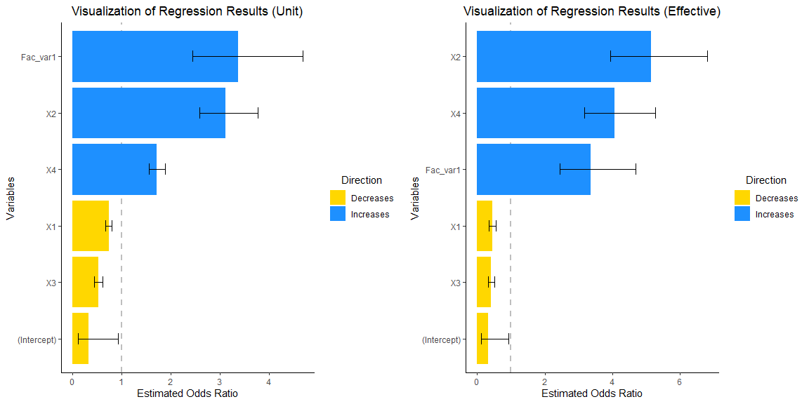
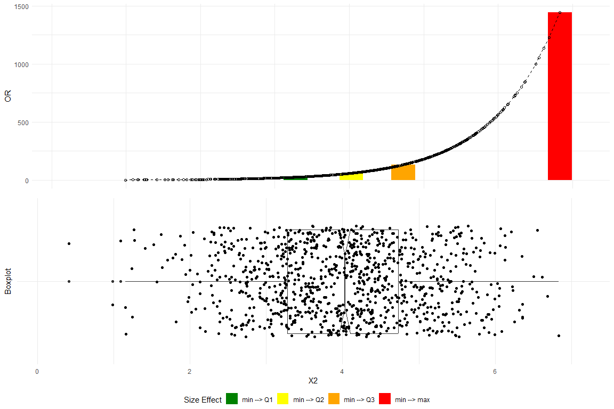
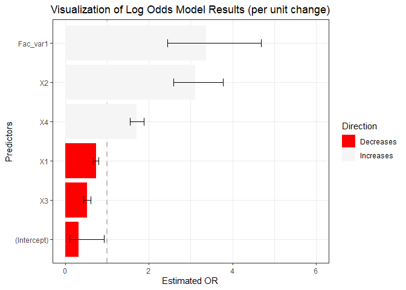
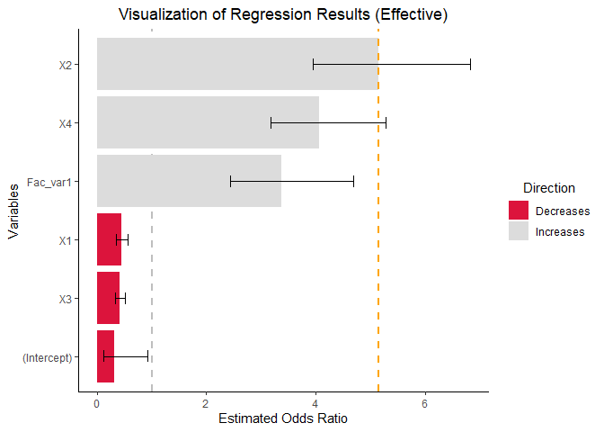

<!-- README.md is generated from README.Rmd. Please edit that file -->

# RegrCoeffsExplorer

<!-- badges: start -->


<!-- badges: end -->

*Always present effect sizes for primary outcomes* (Wilkinson 1999).

*The size of the regression weight depends on the other predictor
variables included in the equation and is,therefore, prone to change
across situations involving different combinations of predictors*
(Dunlap and Landis 1998).

*Any interpretations of weights must be considered context-specific*
(Thompson 1999).

The goal of `RegrCoeffsExplorer` is to enhance the interpretation of
regression results by providing visualizations that integrate empirical
data distributions. This approach facilitates a more thorough
understanding of the impacts of changes exceeding one unit in the
independent variables on the dependent variable for models fitted within
Linear Models (LM), Generalized Linear Models (GLM), and Elastic-Net
Regularized Generalized Linear Models (GLMNET) frameworks.

## Installation

You can install the current version of `RegrCoeffsExplorer` from
[GitHub](https://github.com/vadimtyuryaev/RegrCoeffsExplorer) with:

``` r
# install.packages("devtools")
devtools::install_github("vadimtyuryaev/RegrCoeffsExplorer", ref = "main")
```

## A Very Brief Recap on Logistic Regression

Logistic regression is a statistical method used for binary
classification. Unlike linear regression, which predicts continuous
outcomes, logistic regression predicts the probability of a binary
outcome (1 or 0, Yes or No, True or False). The core function in
logistic regression is the **logistic function**, also known as the
sigmoid function, which maps any input into the range (0, 1), making it
interpretable as a **probability**. In logistic regression, we model the
**log odds** of the probability as a linear function of the input
features.

Sigmoid function is defined as:

$$\begin{align}\label{sigmoid} \sigma(z)=\frac{1}{1+\exp(-z)} \end{align}$$

Probability of **success** is calculated in the following manner:

$$\begin{align}\label{prob} P(Y=1|\textbf{X})&=\frac{\exp(\beta_{0}+\beta_{1}X_{1}+\ldots+\beta_{n}X_{n})}{1+\exp(\beta_{0}+\beta_{1}X_{1}+\ldots+\beta_{n}X_{n})}&=\frac{\exp(\textbf{X}\beta)}{1+\exp(\textbf{X}\beta)}&=\frac{1}{1+\exp(-\textbf{X}\beta)} \end{align}$$

Odds Ratio is:

$$\begin{align}\label{oddsratio} \frac{P(Y=1|\textbf{X})}{P(Y=0|\textbf{X})}&=\frac{\frac{\exp(\textbf{X}\beta)}{1+\exp(\textbf{X}\beta)}}{1- \frac{\exp(\textbf{X}\beta)}{1+\exp(\textbf{X}\beta)}}&=\exp(\beta_{0}+\beta_{1}X_{1}+\ldots+\beta_{n}X_{n}) \end{align} $$

Log Odds or the Logistic Transformation of the probability of success
is:

$$\begin{align}\label{logods} \log{\frac{P(Y=1|\textbf{X})}{P(Y=0|\textbf{X})}}&=\beta_{0}+\beta_{1}X_{1}+\ldots+\beta_{n}X_{n} \end{align} $$

Change in log odds when one predictor variable ($X_{1}$) increases by
one unit, while **all other variables remain unchanged**:

$$\begin{align}\label{beta} \log{\frac{P(Y=1|\mathbf{X_{X_1=X_1+1}})}{P(Y=0|\mathbf{X_{X_1=X_1+1}})}} -\log{\frac{P(Y=1|\mathbf{X_{X_1=X_1}})}{P(Y=0|\mathbf{X_{X_1=X_1}})}} &=\beta_{0}+\beta_{1}(X_{1}+1)+\ldots+\beta_{n}X_{n} - (\beta_{0}+\beta_{1}X_{1}+\ldots+\beta_{n}X_{n}) = \beta_{1} \end{align} $$

Therefore, coefficient $\beta_{1}$ shows expected change in the Log Odds
for a one unit increase in $X_1$. Thus, expected change in the Odds
Ratio is $\exp(\beta_{1})$. Finally, expected change in the Odds Ratio
if $X_1$ changes by k units whilst all other variables remain unchanged
is $[\exp(\beta_{1})]^k$ or $\exp(\beta_{1} \times k)$.

## Examples

### Consider implications of a change exceeding one unit on the Odds Ratio

To generate a dataset for logistic regression analysis, we simulate four
continuous predictor variables and one categorical predictor variable.
The continuous predictors are sampled from a normal distribution, each
with distinct means and standard deviations. The categorical predictor
is generated as a dummy variable with two levels. The binary response
variable is calculated by applying a logistic function to a linear
combination of the predictors, thereby transforming the latent variable
to a probability scale, which serves as the basis for generating binary
outcomes through a binomial sampling process.

``` r

library(RegrCoeffsExplorer)
library(gridExtra)
#> Warning: package 'gridExtra' was built under R version 4.1.3

# Set seed for reproducibility
set.seed(1945)

# Set the number of observations
n = 1000

# Random means and SDs
r_means = sample(1:5, 4, replace = TRUE)
r_sd = sample(1:2, 4, replace = TRUE)

# Generate predictor variables
X1 = rnorm(n, mean = r_means[1], sd = r_sd[1])
X2 = rnorm(n, mean = r_means[2], sd = r_sd[2])
X3 = rnorm(n, mean = r_means[3], sd = r_sd[3])
X4 = rnorm(n, mean = r_means[4], sd = r_sd[4])

# Create a dummy variable
F_dummy=sample(1:2, n, replace = TRUE) - 1

# Convert to factor
Fac_var=factor(F_dummy)

# Define coefficients for each predictor
beta_0 = -0.45
beta_1 = -0.35
beta_2 = 1.05
beta_3 = -0.7
beta_4 = 0.55  
beta_5 = 1.25

# Generate the latent variable
latent_variable = beta_0 + beta_1*X1 + beta_2*X2 + beta_3*X3 + beta_4*X4 +beta_5*F_dummy

# Convert the latent variable to probabilities using the logistic function
p = exp(latent_variable) / (1 + exp(latent_variable))

# Generate binomial outcomes based on these probabilities
y = rbinom(n, size = 1, prob = p)

# Fit a GLM with a logistic link, including the factor variable
glm_model = glm(y ~ X1 + X2 + X3 + X4 + Fac_var, 
                family = binomial(link = "logit"),
                data = data.frame(y, X1, X2, X3, X4, Fac_var))


grid.arrange(vis_reg(glm_model, CI = TRUE, intercept = TRUE,
        palette = c("dodgerblue", "gold"))$"SidebySide")
```



Please note that upon consideration of the empirical distribution of
data, particularly concerning the influence on the response variable,
`y`, attributable to the interquartile change (Q3-Q1) in the dependent
variables, there is a discernible enlargement in the magnitudes of
coefficients `X1` and `X2`.

Let us delve further into the underlying reasons for this phenomenon.

### Check estimated coefficients

``` r
summary(glm_model)
#> 
#> Call:
#> glm(formula = y ~ X1 + X2 + X3 + X4 + Fac_var, family = binomial(link = "logit"), 
#>     data = data.frame(y, X1, X2, X3, X4, Fac_var))
#> 
#> Deviance Residuals: 
#>     Min       1Q   Median       3Q      Max  
#> -2.8488  -0.7365   0.2621   0.7452   2.5295  
#> 
#> Coefficients:
#>             Estimate Std. Error z value Pr(>|z|)    
#> (Intercept) -1.12972    0.54095  -2.088   0.0368 *  
#> X1          -0.30907    0.04524  -6.831 8.42e-12 ***
#> X2           1.13339    0.09617  11.785  < 2e-16 ***
#> X3          -0.65286    0.08637  -7.559 4.06e-14 ***
#> X4           0.53535    0.04935  10.848  < 2e-16 ***
#> Fac_var1     1.21505    0.16635   7.304 2.79e-13 ***
#> ---
#> Signif. codes:  0 '***' 0.001 '**' 0.01 '*' 0.05 '.' 0.1 ' ' 1
#> 
#> (Dispersion parameter for binomial family taken to be 1)
#> 
#>     Null deviance: 1371.37  on 999  degrees of freedom
#> Residual deviance:  930.71  on 994  degrees of freedom
#> AIC: 942.71
#> 
#> Number of Fisher Scoring iterations: 5
```

### Obtain Odds Ratio (OR)

``` r
exp(summary(glm_model)$coefficients[,1])
#> (Intercept)          X1          X2          X3          X4    Fac_var1 
#>   0.3231247   0.7341269   3.1061734   0.5205559   1.7080454   3.3704659
```

The coefficients for `X1` through `X5` represent the change in the OR
for a **one-unit shift** in these coefficients, while the coefficient
for `Fac_Var1` signifies the variation in OR resulting from a transition
from the reference level of 0 to a level 1 in the factor variable. At
first glance, it may seem that the factor variable exerts the most
significant impact on the odds ratio.Yet, this interpretation can often
be deceptive, as it fails to take into account the distribution of
empirical data.

### Real data differences

``` r

# Calculate all possible differences (1000 choose 2)
all_diffs <- combn(X2, 2, function(x) abs(x[1] - x[2]))

# Count differences that are exactly 1 units
num_diffs_exactly_one = sum(abs(all_diffs) == 1)

# Count the proportion of differences that more or equal to 2 units
num_diffs_2_or_more = sum(abs(all_diffs)>=2)/sum(abs(all_diffs))

print("Number of differences of exactly 1 unit:")
#> [1] "Number of differences of exactly 1 unit:"
num_diffs_exactly_one
#> [1] 0
print("Proportion of differences of two or more units:")
#> [1] "Proportion of differences of two or more units:"
num_diffs_2_or_more
#> [1] 0.1500364
```

None of the differences observed within the values of the variable `X2`
equate to a single unit. Furthermore, in excess of $15\%$ of these
differences are equal or surpass a magnitude of two units.Therefore,
when analyzing standard regression output displaying per-unit
interpretations, we, in a sense, comment on difference that might not
exist in the real data.Consequently, when engaging in the analysis of
standard regression outputs that provide interpretations on a per-unit
basis, there is an implicit commentary on disparities that may not be
present within the actual data. A more realistic approach is to utilize
an actual observable difference, for example `Q3`-`Q1`, to calculate the
OR.

### Plot changes in OR and empirical data distribution.

``` r

plot_OR(glm_model, 
        data.frame(y, X1, X2, X3, X4, Fac_var), 
        var_name="X2",
        color_filling=c("#008000", "#FFFF00","#FFA500","#FF0000"))$"SidebySide"
```



The top plot delineates the variations in the OR corresponding to data
differentials spanning from the minimum to the first quartile (Q1), the
median (Q2), the third quartile (Q3), and the maximum.The bottom plot
depicts a boxplot with a notch to display a confidence interval around
the median and jitters to add random noise to data points preventing
overlap and revealing the underlying data distribution more clearly.
substantial changes in the OR progressing alone the empirical data as
clearly observed.

``` r
require(ggplot2)

vis_reg(glm_model, CI = TRUE, intercept = TRUE,
        palette = c("dodgerblue", "gold"))$PerUnitVis+
  ggtitle("Visualization of Log Odds Model Results (per unit change)")+
  ylim(0,6)+
  xlab("Predictors")+
  ylab("Estimated OR")+
  theme_bw()+
  scale_fill_manual(values = c("red","whitesmoke" ))+                            
  theme(plot.title = element_text(hjust = 0.5))   
```



``` r
vis_reg(glm_model, CI = TRUE, intercept = TRUE,
        palette = c("dodgerblue", "gold"))$RealizedEffectVis+
  scale_fill_manual(values = c("#DC143C","#DCDCDC" ))+
  geom_hline(yintercept=exp(summary(glm_model)$coefficients[,1][3]*IQR(X2)),    # note the calculation
             linetype="dashed", color = "orange", size=1)
```



## Vignettes

Would you like to know more? Please, check out the in-depth vignettes
below.

``` r

vignette("BetaVisualizer", 
         package = "RegrCoeffsExplorer")

vignette("OddsRatioVisualizer", 
         package = "RegrCoeffsExplorer")
```

## Estimation of Confidence Intervals for Objects Fitted Using LASSO Regression

It is imperative to to gain a comprehensive understanding of the
post-selection inference rationale and methodologies prior to the
generation and graphical representation of confidence intervals for
objects fitted via the Elastic-Net Regularized Generalized Linear
Models. Please, kindly consult the designated literature below and the
`BetaVisualizer` vignette.

1.  [Statistical Learning with
    Sparsity](https://www.ime.unicamp.br/~dias/SLS.pdf)
2.  [Recent Advances in Post-Selection Statistical
    Inference](https://www.math.wustl.edu/~kuffner/TibshiraniSlides.pdf)
3.  [Tools for Post-Selection
    Inference](https://cran.r-project.org/web/packages/selectiveInference/selectiveInference.pdf)

# References

<div id="refs" class="references csl-bib-body hanging-indent">

<div id="ref-Dunlap1998Interpretations" class="csl-entry">

Dunlap, W., and R. Landis. 1998. “Interpretations of Multiple Regression
Borrowed from Factor Analysis and Canonical Correlation.” *Journal of
General Psychology* 125: 397–407.
<https://doi.org/10.1080/00221309809595345>.

</div>

<div id="ref-Thompson1998" class="csl-entry">

Thompson, B. 1999. “Five Methodology Errors in Educational
Research:apantheon of Statistical Significance and Other Faux Pas.”
*Advances in Social Science Methodology* 5: 23–86.
https://doi.org/<https://files.eric.ed.gov/fulltext/ED419023.pdf>.

</div>

<div id="ref-Wilkinson1999Statistical" class="csl-entry">

Wilkinson, Leland. 1999. “Statistical Methods in Psychology Journals:
Guidelines and Explanations.” *American Psychologist* 54: 594–604.
<https://doi.org/10.1037/0003-066X.54.8.594>.

</div>

</div>
